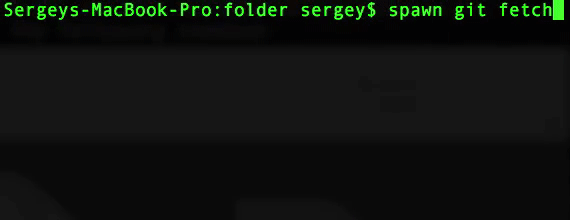

# spawn-lord
Command line utility for hipsters 👓 which helps to to automate parallel execution of same command in different folders 

## installation
`npm install -g spawn-lord`

## usage example
assuming you have the following folders structure:

```
/folder
  |-/project1 //git-based project
  |-/project2 //also git-based project
```

Lets say you want to call `git fetch` in both *project1* and *project2*.
You can achieve this by calling the following command:

```sh
cd /folder
spawn git fetch
```

`git fetch` will be spawned and executed in parallel in all folders under current working folder:

